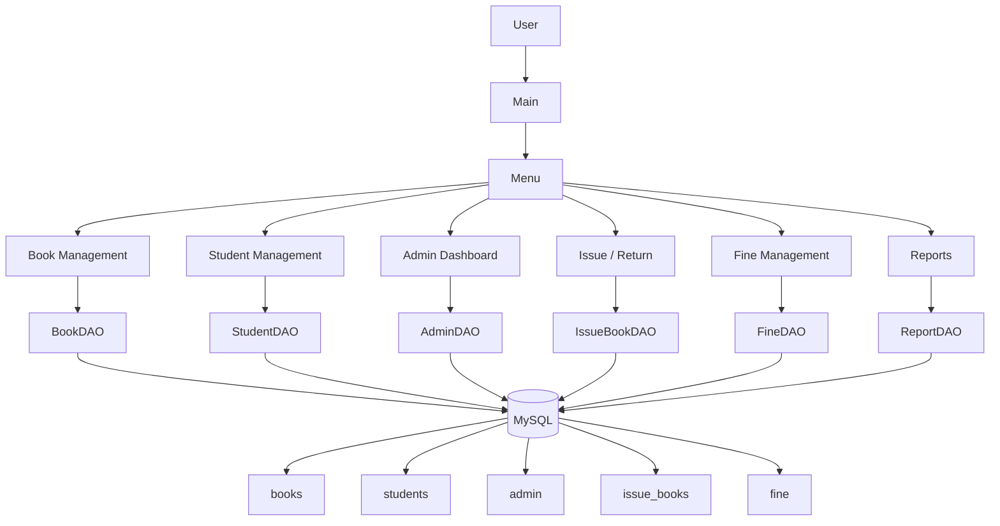

# Project Architecture

## Notes
- `Menu` is the console entry point for all workflows.
- DAO classes isolate SQL from the UI and business flow.
- `DBConnection` centralizes MySQL access.
- `Validation` and `LoggerUtil` provide cross-cutting support.