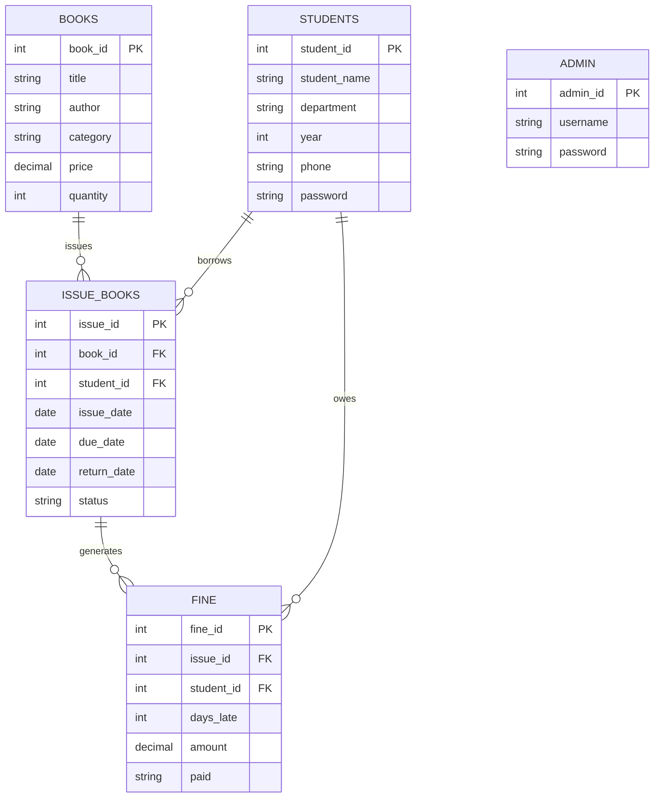

# Database ER Diagram

```mermaid
erDiagram
    BOOKS {
        int book_id PK
        string title
        string author
        string category
        decimal price
        int quantity
    }

    STUDENTS {
        int student_id PK
        string student_name
        string department
        int year
        string phone
        string password
    }

    ADMIN {
        int admin_id PK
        string username
        string password
    }

    ISSUE_BOOKS {
        int issue_id PK
        int book_id FK
        int student_id FK
        date issue_date
        date due_date
        date return_date
        string status
    }

    FINE {
        int fine_id PK
        int issue_id FK
        int student_id FK
        int days_late
        decimal amount
        string paid
    }

    BOOKS ||--o{ ISSUE_BOOKS : issues
    STUDENTS ||--o{ ISSUE_BOOKS : borrows
    ISSUE_BOOKS ||--o{ FINE : generates
    STUDENTS ||--o{ FINE : owes
```

## Relationships
- A book can appear in many issue records.
- A student can borrow many books over time.
- An overdue issue can generate a fine record.